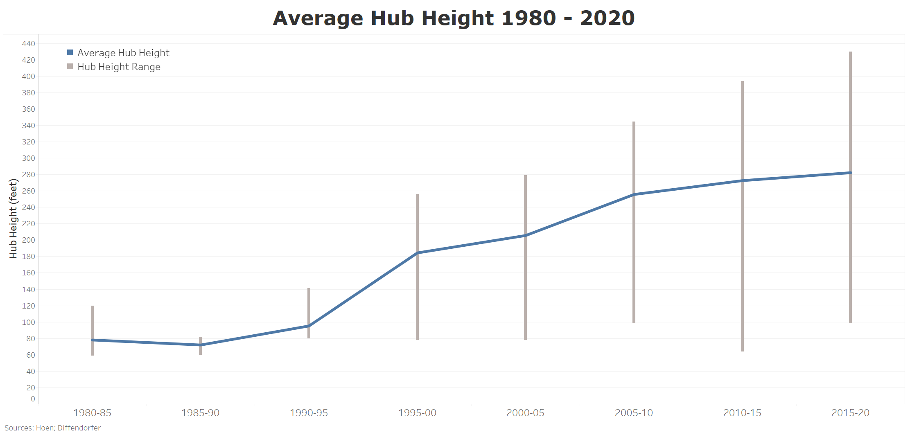
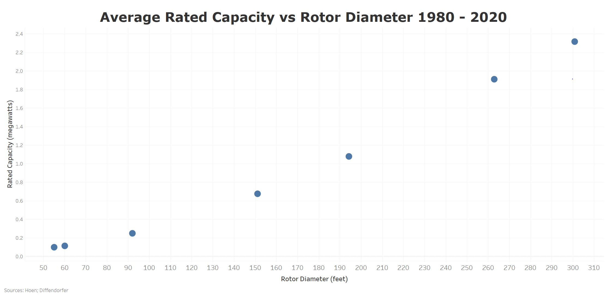
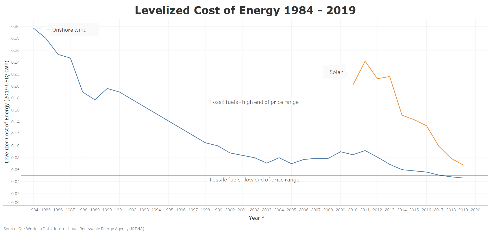

# Wind Power
An analysis of wind turbine installations in the United States since 1980, which includes analyzing how wind turbine height, rotor diameter and rated capacity has changed over time using data from the United States Wind Turbine Database.

* **View Presentation on [Tableau Public](https://public.tableau.com/profile/hsopel#!/vizhome/WindPower-NSSCapstone/Presentation?publish=yes)**

* **[Presentation Transcript](/presentation/Wind_Presentation_Transcript.pdf)**

### Motivation
My brother has worked as a wind turbine technician for almost three years, but before choosing this topic I didn’t know much about wind turbines and the advances and challenges facing the industry. This past summer my brother showed me his wind turbine work app that displays current wind speed and energy output (among more technical things) for each Vestas turbine. That data, of course, isn’t available to the public, but there are numerous datasets about wind turbine models/installations and energy breakdowns by country/state/county, etc. available online. I didn’t realize how large of a role data analytics plays in every aspect of designing, installing, and maintaining wind turbines. I really enjoyed learning more about the industry that my brother has made his career in and that is projected to serve up to 35% of the United State’s end use energy demand by 2050.

### Data Questions
1. How has onshore wind turbine height, rotor diameter, and rated capacity changed over time?
2. How has price affected the installed capacity/electricity generation over time?
3. How has the wind energy industry continued to innovate to mitigate risk to humans and wildlife?

### Key Findings

### Tools used
* Excel
* Python 3.8.3
* Jupyter Notebook
* Tableau

### Data Sources
* US Wind Turbine Database
* US Onshore Turbines Through 2014
* Our World in Database
* Pew Research Center
* WINDExchange
* American Wind Energy Association
* Complete Works Cited [here](/presentation/works_cited.pdf)
